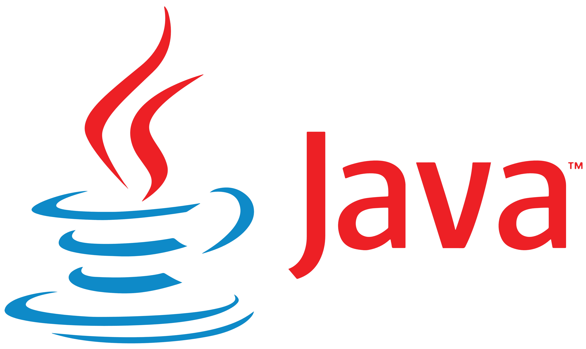

<br />

**JAVA** -  one of the most popular and widely used programming languages language for coding web applications. Java is platform independent, programs are compiled into an intermediate representation called bytecode, which can run on any system with a Java Virtual Machine. See more in their [documentation](https://dev.java/).

## Code exemple:

```java
public class MathOp {
    public static int calculateFactorial(int n) {
        if (n == 0) {
            return 1;
        } else {
            return n * calculateFactorial(n - 1);
        }
    }

    public static void main(String[] args) {
        int number = 6;
        int result = calculateFactorial(number);
        System.out.println("Factorial of " + number + " is: " + result);
    }
}


```

<br />
<br />
 
## Who use JAVA

- Twitter
- Netflix
- Uber
- Google
- Alibaba

<br />
<br />

## My projects in JAVA

- [TicTacToe](../projects/java-tictactoe.md)
- [Time Tracking](../projects/time-tracking-cmd.md)

