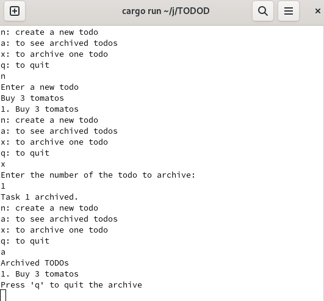

# Rust todo list 

This todo list coded in Rust and it runs from command line. What you can do is by typing 'a', the application showcases all archived todos, allowing you to reminisce or manage them further. To return to the primary view, just press 'q'. If you're ready to add a new todo and continue your productive journey, type 'n', to archive your todo you need to type 'x'. The application prompts you to enter the details of your new task, and once added, presents the updated list of todos.

## Interface

  

This project allowed me to learn basics of Rust, and to try to use them to create something. Interface and waht is behind it is veyr simple, but todo list is so usefull and easy to use at the same time.

You can see the code in my [Repository GitHub](https://github.com/dbeznos2/report).