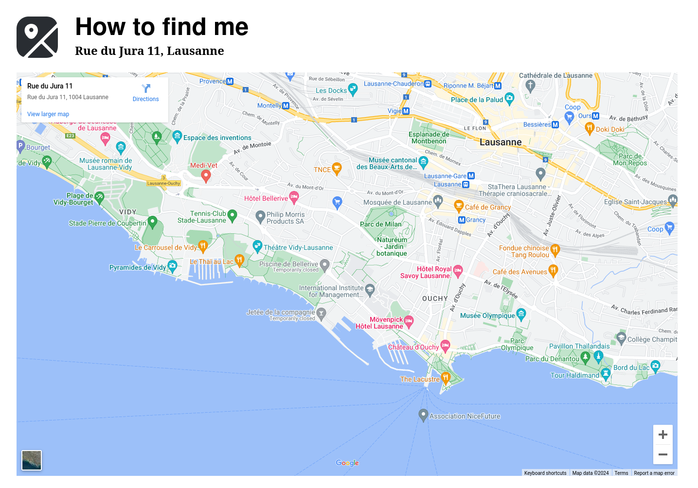
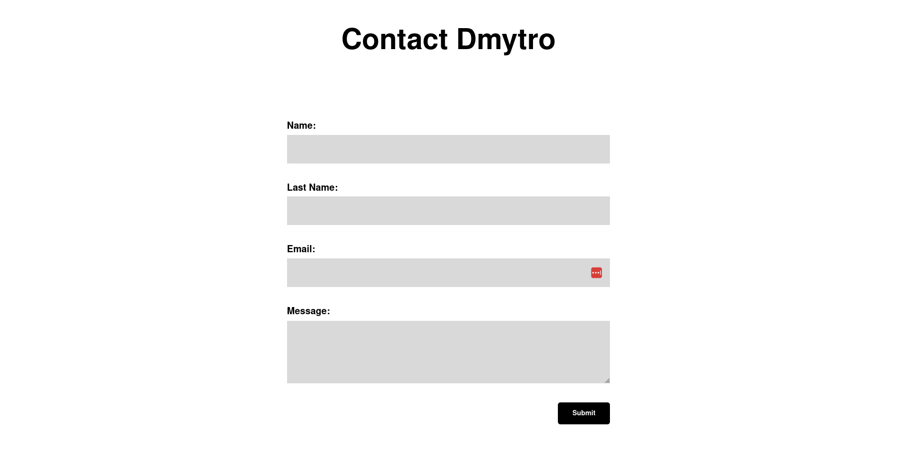
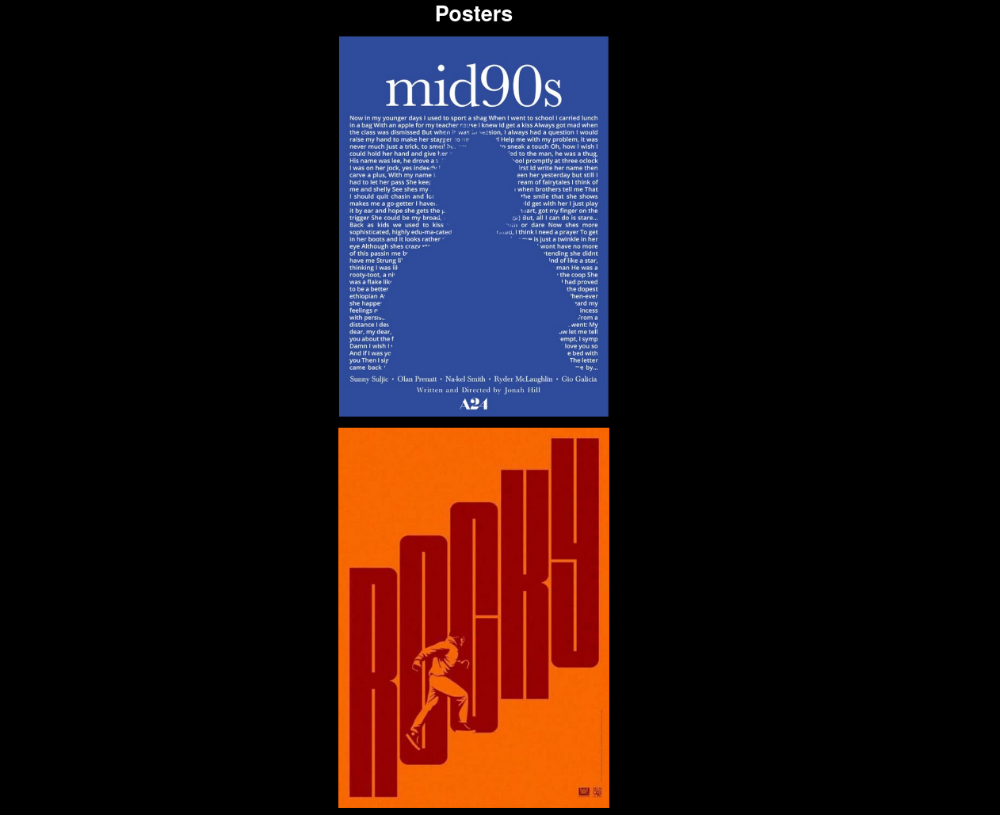

# Site web statiqiue

**I present to you my very first website, it's a kind of portfolio, where I add some design work, etc. The website contains pages with an interactive map, a contact form and pages with design work. This project helped me learn the basics of HTML and CSS and create a mockup of a website using figma.**

## Map
**Here is an interactive map, where the customer can interact with the map interface to find our location.**


## Code map
```html
<body>
    <main>
    <div class="grid">
        
        <h1 class="how">How to find me</h1>
        <h2 class="address">Rue du Jura 11, Lausanne</h2>
        <div class="real_map">
            <iframe src="https://www.google.com/maps/embed?pb=!1m18!1m12!1m3!1d2745.
            1270003780683!2d6.621534912998277!3d46.52538867099062!2m3!1f0!2f0!3f0!3m2!
            1i1024!2i768!4f13.1!3m3!1m2!1s0x478c2e28dd3c3b7b%3A0xa983d5c04f615893!2sRue%
            20du%20Jura%2011%2C%201004%20Lausanne!5e0!3m2!1sen!2sch!4v1697200500808!5m2!1sen!2sch"
             width="1359" height="830" style="border:0;" allowfullscreen="" loading="lazy" 
            referrerpolicy="no-referrer-when-downgrade"></iframe>
        </div>
    </div>
</main>
</body>
```

## Contact form
**Here is a contact form, which customer can fill with personal information and live a message.**



## Code contact form

```html
<body>
    <div class="grid">
    <h1 class="contact_title">Contact Dmytro</h1>
    <form action="submit.php" method="post">
        <label for="name">Name:</label>
        <input type="text" id="name" name="name" required>
        <br><br>

        <label for="last_name">Last Name:</label>
        <input type="text" id="last_name" name="last_name" required>
        <br><br>

        <label for="email">Email:</label>
        <input type="email" id="email" name="email" required>
        <br><br>

        <label for="message">Message:</label>
        <textarea id="message" name="message" rows="4" required></textarea>
        <br><br>

        <div class="button-container">
            <input type="submit" value="Submit">
        </div>
    </form>
</div>
</body>
```

## Poster page
**Here is a page that displays movie posters, for customer to see what work we propose.**




## Code poster's page

```html
<main>
        <div class="grid">
        <div class="posters">
            <h1>Posters</h1>
        </div>
        <div class="poster_blue">
            
            </div>
            <div class="rocky">
            
        </div>
        <div class="whiplash">
            
        </div>
    </div>
    </main>
```


